# Game States

The game state is the fundamental building block for all text adventure games. You must have at least one game state for every game.

## Key Concepts

### Game State Id
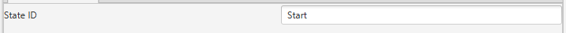

A game state id is something that identifies a game state. Note: This must be unique, no two game states should ever share the same ID.

### Text Log
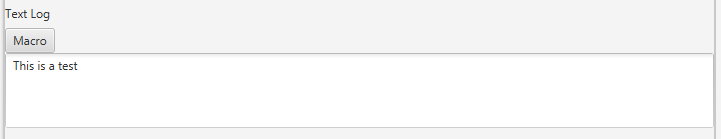

A text log is any text that you would like to associate with a game state. As soon as the game state is reached the text log will be added to the players screen.

### Macros
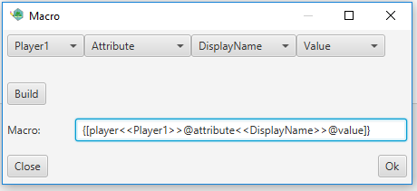

Macros can be added to the text log. A macro allows the game to display information about a player in the text area. For example if you would like to greet the player you can create a macro for the players display name as seen above. To use macros press the macro button, build the macro using the combo boxes, press build and the press ok. Once you press ok some strange formatted text will be inserted into the text log. Do not worry about that as at run time it will display something else.

### Layout

A layout identifies how you would like your game state to be displayed. In the furture I would like to refine layouts a bit more.

#### Selecting a layout
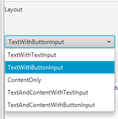

* TextWithTextInput - This will display a screen with a text area and a text based input field.
* TextWithButtonInput - This will display a screen with a text area and a collection of buttons based off of option.
* ContentOnly - This will only display content. You will have to prove content to display. Content can be either a video file or a image file.
* TextAndContentWithTextInput - This will display a screen with a text area, a content area and a text based input field.
* TextAndContentWithButtonInput - This will display a screen with a text area, a content area and a collection of buttons based off of options.

### Options
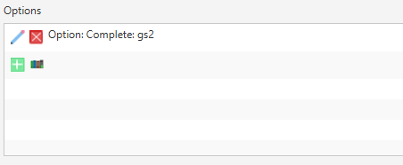

The option is one of the key logic parts of a game state. A option is a collection of [triggers](#Triggers) to an [action](#Action). When any trigger assoicated with a game state is hit an action will fire. This is used to do various things.

### Triggers

A trigger is the key logic flow of a game state. A trigger can either fire or not fire based off of what your player typed or your players current state.

#### Text Trigger

A text trigger evaluates what was typed. If the trigger definition matches what was typed the trigger will succeed.

##### Creating a text trigger

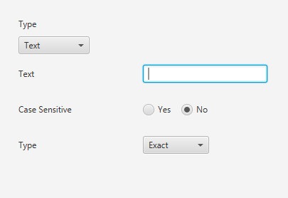

* Text - The text or portion of text you would like to verify. 
    > Note: if you know regex you can use a regex here but type must be exact
* Case Sensitive - If you would like text casing to matter or not. For example with case sensitive set to yes `Test` would be different from `test`.
* Type
    * Exact - The text inserted must be exactly the same as the text in the text area
    * Prefix - The text must start with what was typed in the text area.
    * Suffix - The text must end with what was typed in the text area.
    * Contains - The text must be somewhere in what was typed.

#### Player Trigger

A player trigger evaluates a player. If the player is in the same state as defined the trigger will succeed.

##### Creating a player trigger

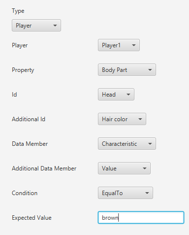

* Player - The player to evaluate.
* Property - What about the player to evaluate.
* Id - The specific property to evaluate.
* Additional Id - The data members id to evaluate. Note: This will only be an option sometimes.
* Data Member - The data associated with the id to evaluate
* Additional Data Member - The data assoicated with the Additional Id to evaluate. Note: This will only be an option sometimes.
* Condition
    * EqualTo - If the data is equal to the expected value.
    * GreaterThan - If the data is greater than the expected value.
    * LessThan - If the data is less than the expected value.
    * NotEqual - If the data is not equal to the exepected value.
    * Has - If the data has the expected value.

#### Scripted Trigger

A scripted trigger runs some javascript. If the javascript function returns true the trigger will fire.

> Note this is a bit more of an advanced option

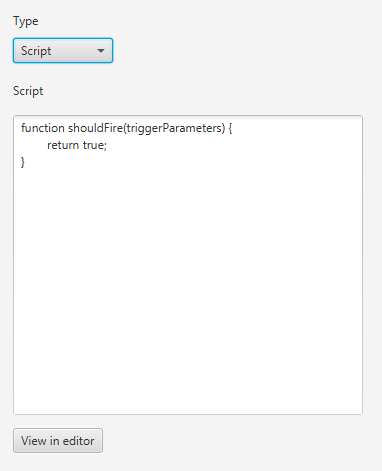

When the trigger is evaluated the shouldFire() function will be called. The shouldFire() function must return a true or false value. If you press the View in editor button it will open the code in your javascript associated application. Once you are done exiting that application should update the script text field.

#### Multi Part Trigger

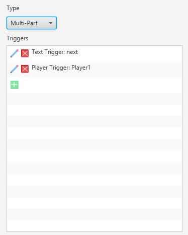

A multipart trigger is a collection of many triggers. In order for a multipart trigger to fire all of its triggers must also fire.

### Actions

An action is what you would like your game to do when a [trigger](#Triggers) is fired.

#### Append Action

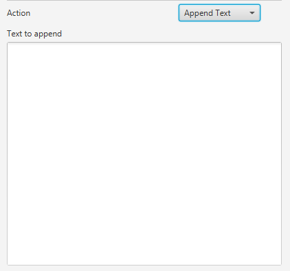

This action will add whatever text is in the text area to the text log when the action is ran.

#### Complete Action

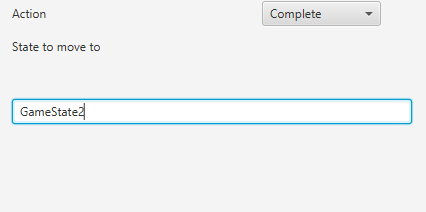

This action will finish the current game state and move to another game state based off of the text typed in the text area. The text in the text area must match another game state's id exactly otherwise this will not work.

#### Execute Action

This action will attempt to run another application or process.

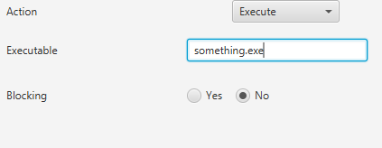

* Executable - The executable you would like to run. This most be an absolute path to a runnable file or the runnable file must be in the users PATH variable otherwise this will not work. Example of a full path: C:\Program Files (x86)\Mozilla FireFox\firefox.exe
* Blocking - If this executable should block the text adventure

#### Modify Player Action

This action will attempt to modify a player. In the below image we are setting a players hair color to blue.

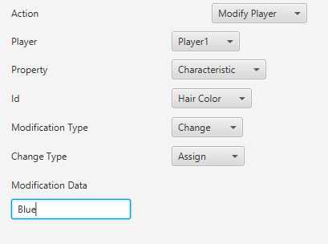

* Player - The player to modify.
* Property - The aspect of the player to modify.
* Id - The exact thing to change about the player. Note this will not show in the case of add modifications.
* Modification Type
    * Add - Adds a specific property to a player.
    * Change - Changes a specific property on a player.
    * Remove - Removes a specific property from a player.
* Change Type
    * Assign - Sets a new value for the property.
    * Add - adds to the current value for the property.
    * Subtract - removes from the current value for the property.

#### Save Action

This action will attempt to save the current game and players to a specific location.

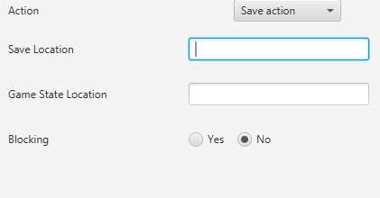

#### Script Action

A scripted action will run some javascript

> Note this is a bit more of an advanced option

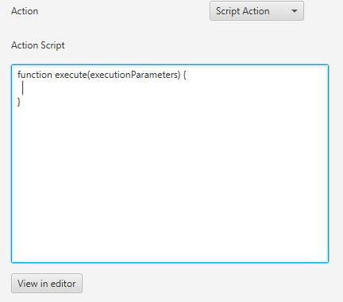

When the action is ran the execute() function will be called. If you press the View in editor button it will open the code in your javascript associated application. Once you are done exiting that application should update the script text field.

#### Finish Action

This action will finish the game and return the user to the applications home screen.

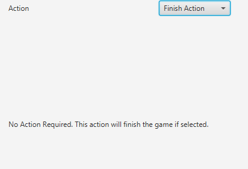

### Timers

A timer will allow a game state to complete to another game state in a certain amount of time after the current game state was loaded.

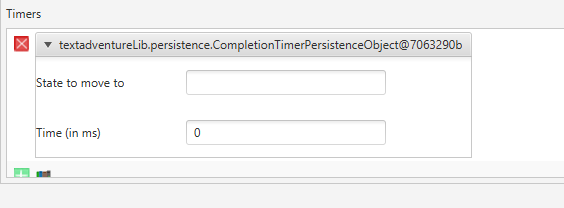