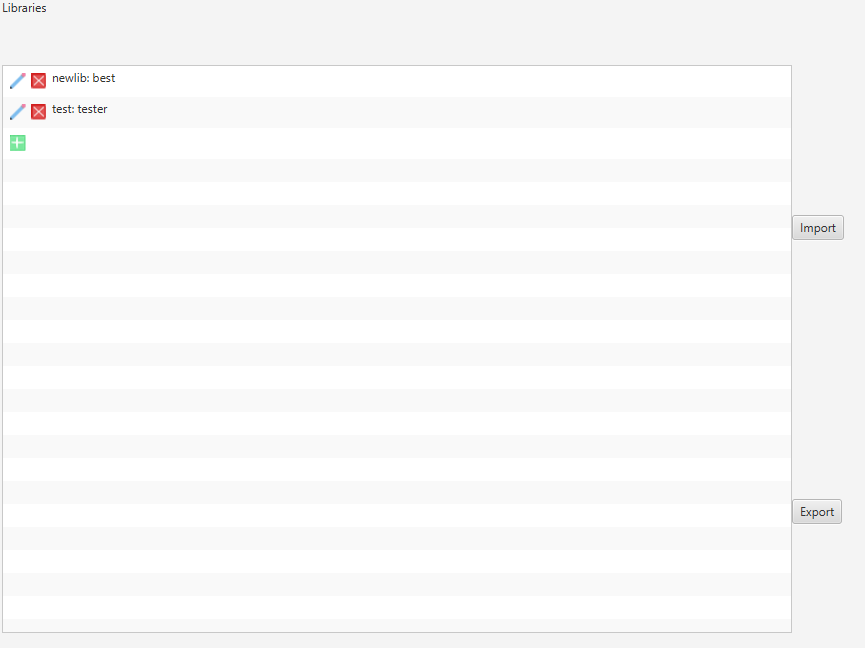

# Libraries

## Creating a Library Item

Press the add button and a new tab will open. In this tab add any Player or game state specific items you would like to make reusable.

## Importing

You can import anyones saved talim files. When you do this a library item will be added to your library and can be used to help build your players and game states.

## Exporting

When you create a library item you can export it at any time. In order to export a library item select it in the list view and press the export button. Once you do this a talim file will be created. You can share this talim file with others so they can use your library item in their games.