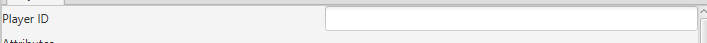
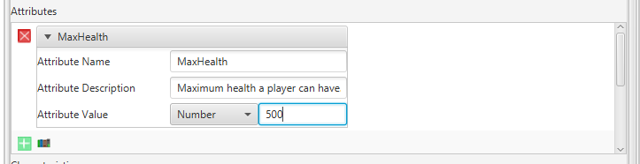
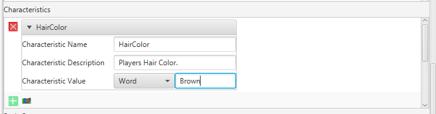
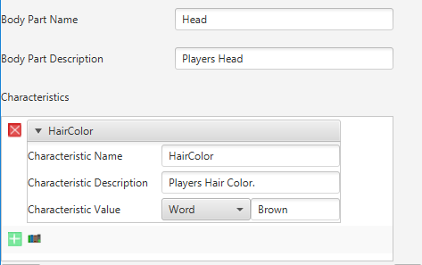
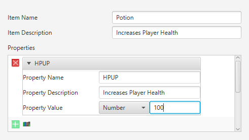

# Players

> Note: You can create a game without a player

## What is a player?

A player is any thing that can interact with the end user to create a more rich game experience. For the most part a player is the person playing the game and the player contains data that can help you build a game that requires less game states and is more interactive.

## Key Concepts

### ID

A player id is something that identifies a player. Note: This must be unique, no two players should ever share the same ID

### Attributes

An attribute is any basic information about your player. Attributes should be data about the player. Some examples of attributes would be the following: DisplayName: players display name, Max Health: How much health a player can have, Current Health: How much health a player currently has, etc.

#### Creating an attribute

* Attribute Name - The name of your attribute.
* Attribute Description - A description about the attribute.
* Type
    * Word - A word that is associated with the attribute. A common example of a word based attribute would be DisplayName.
    * Number - A number is any whole number associated with the attribute. A common example of a number based attribute would be MaxHealth.
    * Decimal - A number that is either a whole or decimal number. A common example of a decimal based attribute would be Currency.
    * True/False - Anything that is or is not about the player. A common example of a True/False based attribute would be IsDead.

### Characteristics

A characteristic is any basic information about how your player appears. Characteristics should rarely be used as data about a player. Instead you can think about characteristics as things that help describe your player. Some examples of characteristics would be the following: HairColor: The player hair color, SkinColor: The players skin color, Height: The players height, etc.

#### Creating a Characteristic

* Characteristic Name - The name of your characteristic
* Characteristic Description - A description about the characteristic
* Type
    * Word - A word that is associated with the characteristic. A common example of a word based characteristic would be HairColor
    * Number - A number is any whole number associated with the characteristic. A common example of a number based characteristic would be Height
    * Decimal - A number that is either a whole or decimal number.
    * True/False - Anything that is or is not about the player. A common example of a True/False based characteristic would be IsMale.

### Body Parts

A body part is any appendage to a player. For the most part body parts are used to equip items to

#### Creating a Body Part

* Body Part Name - The name of the body part
* Body Part Description - A description about the body part
* Characteristics - All [characteristics](#Characteristics) to assoicate with this body part

### Inventory

An inventory is a collection of [items](#Items) and their amounts that a player has.

### Items

A item is anything a player has. Items can be equiped to body parts, but they do not have to be equiped at all.

#### Creating an Item

* Item Name - The name of the item.
* Item Description - A description about the item.
* Properties - All [properties](#Properties) to assoicate with this item.

### Properties

A property is any data about an item. You can think of a property being the same thing to an [item](#Item) as a [attribute](#Attribute) is to a player.

### Creating a Property

* Property Name - The name of your property
* Property Description - A description about the property
* Type
    * Word - A word that is associated with the property. A common example of a word based property would be DisplayName.
    * Number - A number is any whole number associated with the property. A common example of a number based property would be HPUP.
    * Decimal - A number that is either a whole or decimal number. A common example of a decimal based property would be Currency.
    * True/False - Anything that is or is not about the item. A common example of a True/False based property would be IsBreakable.

### Equipment

Equipment is a mapping of body part to item. A body part may only have one item equipped to it at a time.