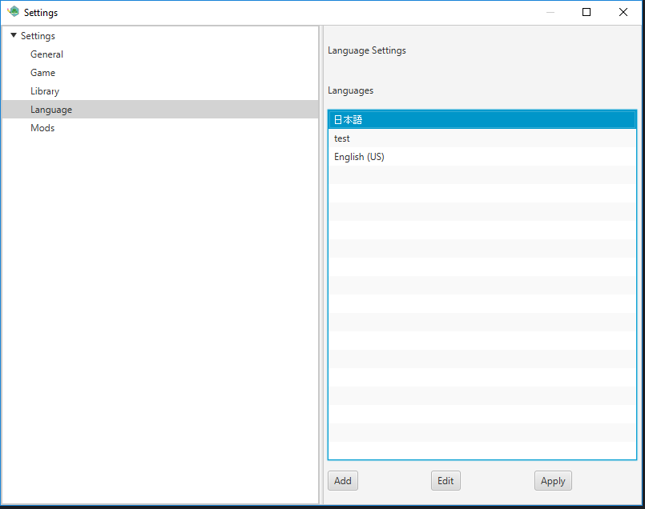
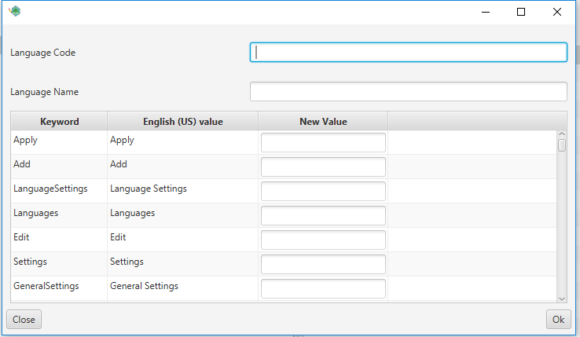

# Languages

A language updates all displayed words in the text adventure creator. This may be useful if you do not understand english.

## Adding a language

You can add a language by adding a language text file to the following folder: UserFolder\nilrem\languages.

## Applying a language

In order to apply a language select the language you would like to use and press the apply button. This change should take affect immediatly.

## Creating a language

At any point in time you can create your own language. In order to do this press the add button.

* Language Code - A short code to assoicate with the language. This must be unique from other * languages. Standard example United States English is en-US.
* Language Name - What you would like to be displayed in the settings list view.
* Keyword - Do not worry about this too much. This is what the application is using as a resource key.
* English (US) value - What the default text would be without any language selected.
New Value - The value you would like to display instead.