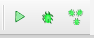
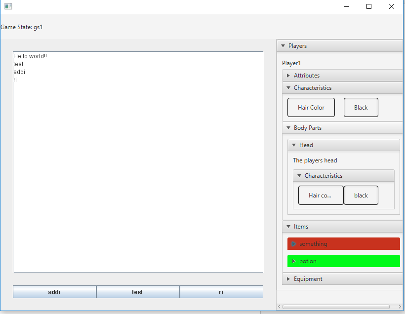

# Debugging

## Running your game

You can run your game at any point in time by pressing either the run toolbar item (green play button) or by pressing Run -> Run. Once you have run your game it will start your game from the first game state. No debugging options will be available but this can help you get a feel for what the game will look like to your end user.

## Single Debug

You can debug as single game state at any point by pressing either the toolbar debug single item (green bug) or by pressing Run -> Debug Single. This will run one of your game states. Once your game state moves on to another game state the window will update to a screen showing the game state id the game is attempting to move to.

## Debugging your game

You can debug your full game at any time by pressing either the toolbar debug item (many green bugs) or by pressing Run -> Debug. Once you do this your game will run and depending on if you have players or not a player pane will open on the right side of the game. In this player pane when a property is changed the property will be updated with a blue color. When a property is removed it will be updated with a red color. When a property is added it will be updated with a green color.