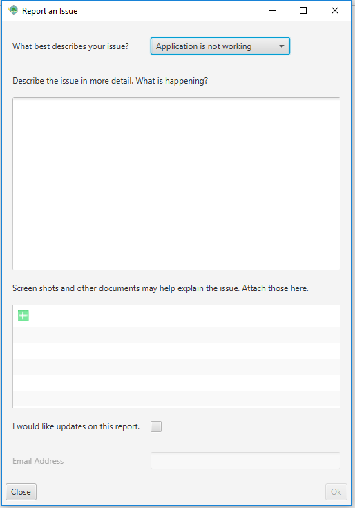

# Feedback

> For the time being this is disabled, but I hope to add it back soon.

If you ever run into an issue or find something you think should be added to this application you can always provide feedback. feedback will be emailed to an email account and may be periodically checked. In order to send feeback press Help -> Report an issue.

* Type of issue
    * Application is not working - Application is crashing and I cannot seem to get it to work.
    * Application is acting strange - Something odd or unexpected is happening.
    * I think the application should - Something you wish was different about the application.
* Describe the issue - Do the best you can to explain what is happening.
* Screen shots another documents - Any attachments you would like to send to help explain this issue.
* I would like updates - When this is checked and an email is provided we will send updates about the issue to you.