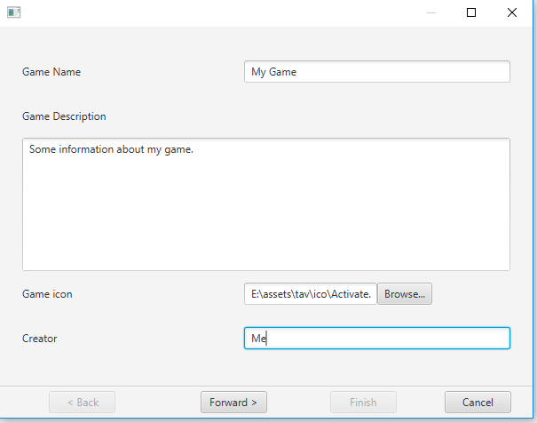
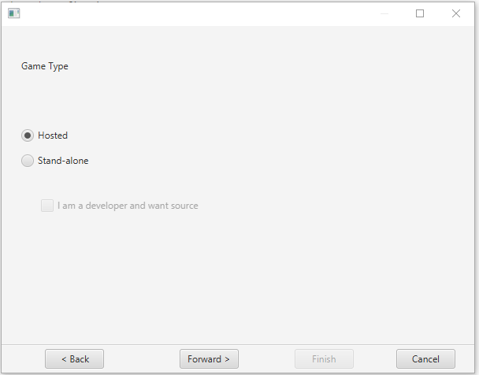
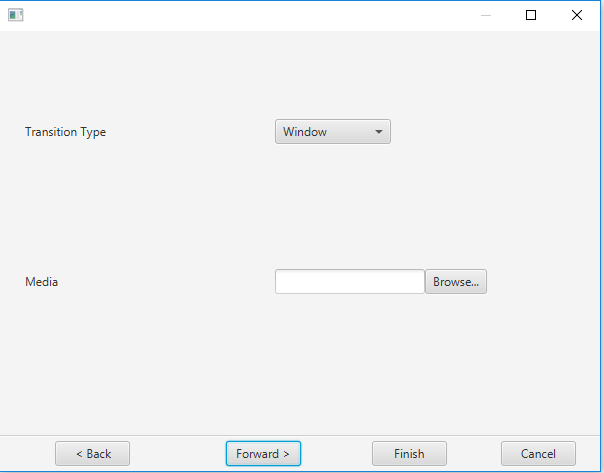
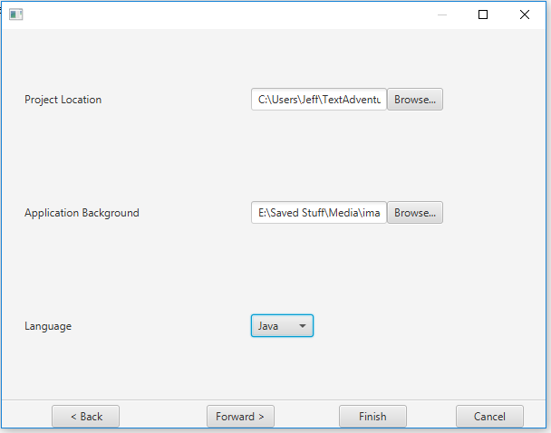
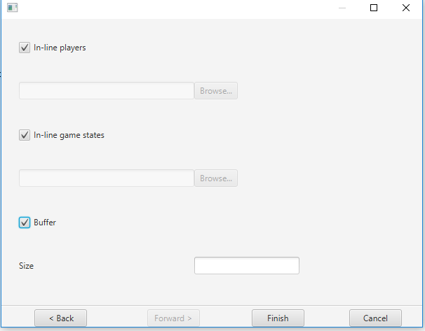
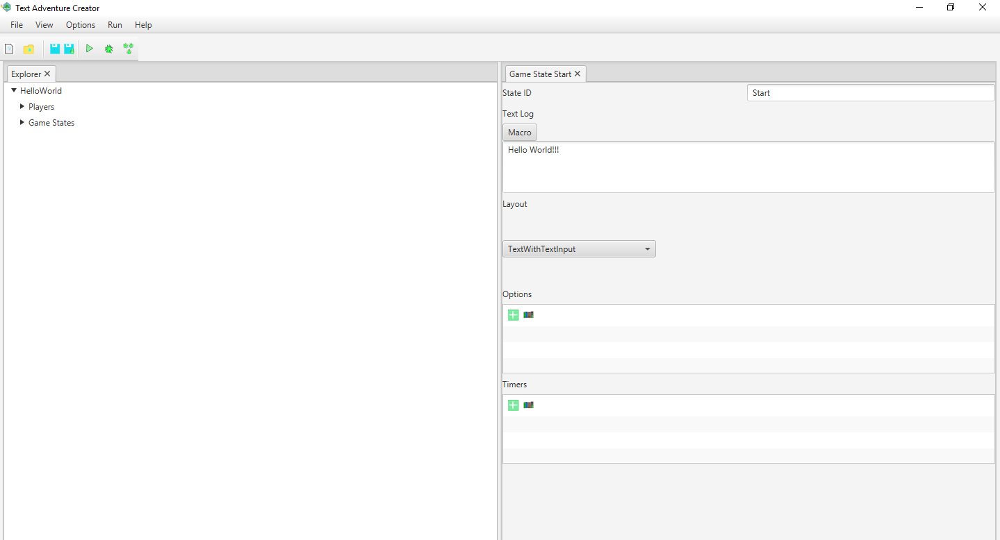
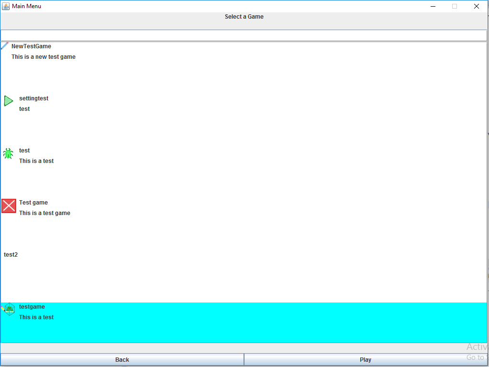
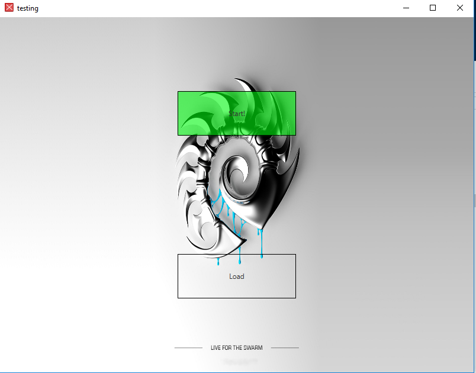

# Creating your first project

So you have decided to start your first project? We will walk you through creating your first project. Start off by running the TextAdventureCreator jar. This can be ran by associating jar files to the java rutime or you can use the command line and run the command `java -jar TextAdventureCreator.jar`

Now that you have the creator running it time to get started. First either press the new project menu item or the new project toolbar item. The menu item can be found under File and is titled new. The toolbar item is the first item in the toolbar.

Once you have done this you should get a configuration wizard to create your first project. We will walk you through configuring your first project

On this first page fill out the information accordingly. Once you have filled this out press forward.

* Game Name - This is the name of your game. Fill this out with what you would want people to see.
* Game Description - This is more information about your game. Fill this out with a short description for people to understand a bit about your game. Note this is not required
* Game icon - This is an icon to assoicate with your game. This icon should be a 32x32 icon. This icon is not required but it may help people identify your game.
* Creator - Who has created this game. If you want to take credit for your game put your name or tag/handle here

On the second page select the appropriate options for your game. Once you have filled out this press foward.

* Hosted - In the case of hosted game we will take care of creating your game. However this comes with a requirement, the game can only be played in the text adventure application.
* Stand-alone - In this case your game will be generated as a jar file and will be able to be played without our application
* I am a developer checkbox - In this case you want the source code. At this point the resposibility for compiling is on you. This will generated a maved based project and you will have full source access to your game

Depending on your selection the third page may vary

If your game was hosted fill out the options accordingly. Once you have finished press forward or finish if you do not care about buffers

* Transition Type - The type of transition you would like your game to have
    * Window - Display your loading media in the main application
    * Splash Screen - Display your media in a separate splash screen
* Media - A media file you would like to display while your game is loading

If your game was stand-alone fill out the options accordingly. Once you have finished press forward or finish if you do not care about buffers

* Project Location - This is the location in which your project will be generated in. If you are not a developer this will be a jar file. If you are a developer this will be a maven project.
* Application Background - The background image for your application.
* Language - This is only selectable if you are a developer. Right now this only creates java games. However in the future this might be extended out to different javascript based games, C++ and any other language

If you have decided to configure buffers fill out this page accordingly.

* In-line players - If you would like players to be inlined into the game check this option. Otherwise set a path to save the players to.
* In-line game states - if you would like game states to be inlined into the game check this option. Otherwise set a path to save the players to.
* Buffer - if you would like the game to be buffered check this option and set a buffer size.

Once you have filled out the configuration to your liking press finish.

Now you will notice the application as updated a bit and a Start State has been created. Lets continue now by creating a simple hello world game.

To keep this simple just type Hello world into the text log area of the game state and select the TextWithTextInput in the layout.

Now its time to deploy your game. If you are a hosted game press Publish under the file menu. If you are a stand-alone non-developer game press Generate under the file menu. If you are a stand-alone developer game press Build under the file menu.

If you are hosted run the text adventure application. Press custom game. Find your game and press play

If you are stand-alone game run the jar file. Note if you are a developer you will have to compile to create the jar file.

Congradulations you have created your very first Text Adventure Game!