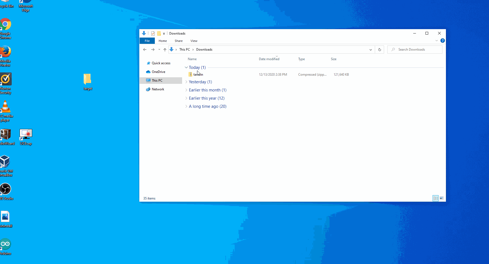

# Installation
Installs can be found on [this page](https://github.com/JeffreyRiggle/textadventurecreator/releases/latest).

## Windows
On [this](https://github.com/JeffreyRiggle/textadventurecreator/releases/latest) install page download the tavwin.zip file. Once that is downloaded extract the content anywhere. Unfortunatly right now this install process does require you to use the command prompt very briefly. Now that the content has been extracted open the windows command prompt as an administrator. Once this is done Run the install.bat file. This file will attempt to set up any prerequisits before running the installer. A video of this installation process can be seen below.



## Ubuntu
On [this](https://github.com/JeffreyRiggle/textadventurecreator/releases/latest) install page download the tavub.zip file. Once that is downloaded extract the content anywhere. Right now this is less than an ideal process but you can run the prereq.sh file. Once that is done you can execute the program manually using the following command

```sh
java -jar textadventurecreator.jar
```
