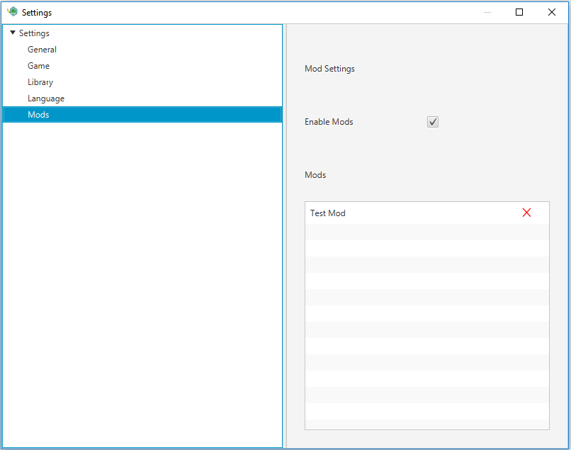

# Mods

A mod is a custom java based file that can run in the current application to enhance the users experience.



## Adding a mod

You can add a mod by placing any mod .jar file in the following directory UserHome\nilrem\mods.

## Changing a mod state

If you ever find that you want to disable any set of mods or all mods you can do this in the settings pane for mods (shown above). When Enable mods is not checked all mods will not be loaded when the application starts up. If you press the red x a mod will be disabled on next start. If you press the green checkbox a mod will be activated on next start.

## Creating a mod

> Note this is a bit more of an advanced topic and requires an understanding of java code.

### Getting started

To start off with choose your favorite IDE for java coding and create a new maven based project. Maven is not a requirement it is just what I prefer. In the future I hope to create a arcitype for mods.

### Simple example

In this example I am going to walk you through creating a simple Hello World style mod

#### Setting up your maven project

In order to build your mod you will have to add a dependency on the TextAdventure creator and you will have to target the 1.8 java framework.

```xml
<dependency>
  <groupId>com.ilusr</groupId>
  <artifactId>TextAdventureCreator</artifactId>
  <version>2.0.0</version>
</dependency>
```

```xml
<plugin>
  <artifactId>maven-compiler-plugin</artifactId>
  <version>3.8.0</version>
  <configuration>
    <release>11</release>
  </configuration>
</plugin>
```

I would also recommend using the resource plugin to package your resource files

The second and most important file is your mod file. In order for your jar to be loaded you must have a class that implements the `ilusr.textadventurecreator.mod.IMod` interface.

```java
public class MyMod implements IMod {

  @Override
  public String id() {
    return "b8d04223-cf31-459f-b6df-cb4b3e64c411";
  }

  @Override
  public void load(ServiceManager manager) {
    IStatusBarService statusBar = manager.<IStatusBarService>get(RegisteredServices.StatusBarService);
    statusBar.addStatusBar(new Label("Hello, World"), LocationProvider.last());
  }

  @Override
  public String name() {
    return "HelloWorldMod";
  }

  @Override
  public void unload() {
    //TODO: Clean up logic here.
  }
}
```

The id should be a unqiue but constant value. I would recommend using a UUID generator to create this value

The load method is what the text adventure creator will run to start your application. This is the main entry point for your mod.

Name is the name to display for your mod. This does not have to be a unique value

unload is where you should put any of your applications clean up logic.

Once you have got the application how you like it you have to make sure that your mod is defined in your meta-inf as a service. In order to do this create the following file structure.

        src
         +- main
          +- resouces
           +- META-INF
            +- services
             - org.tbd.TextAdventureCreator.mod.IMod

Once you have created that file add your mod file class definition in to the text file. Example org.tbd.ModTest.MyMod.

Once all of this is done you are ready to compile. Compile the app and add the jar to file to the mods folder. Mods should be activiated by default.